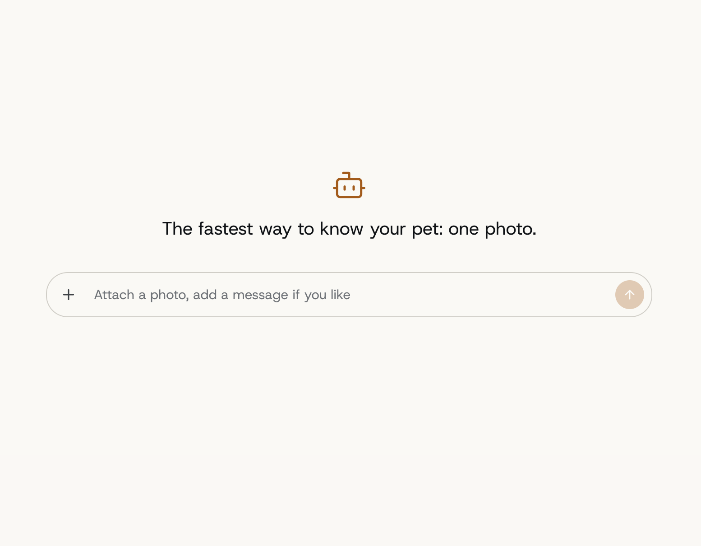
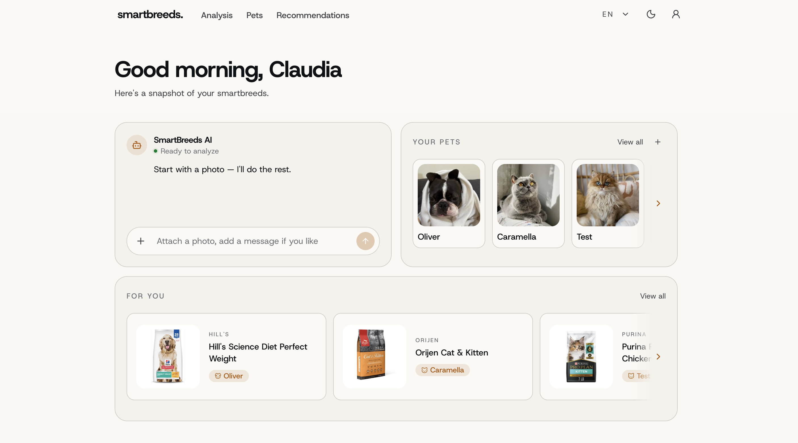

# smartbreeds.

AI-powered pet insights. One photo of your pet and the AI tells you its breed,
traits and health notes, then suggests products that suit it best.

Frontend only: backend and AI services are in the [team repo](https://github.com/Nihilantropy/ft_transcendence).

## Features

- Photo analysis in a chat: breed (crossbreeds included), traits and visible health notes, with
  optional notes for the AI
- Pet profiles with photo, age, weight and health conditions, plus their analysis history
- Product recommendations matched to each pet
- Available in Italian, English and Japanese
- Light and dark theme, responsive down to mobile

## Tech Stack

- React 19 + TypeScript
- Vite
- Tailwind CSS v4 + Radix UI
- React Router v7
- TanStack Query + Zustand
- React Hook Form + Zod
- ky
- i18next

## Getting started

```bash
pnpm install
pnpm dev
```

The dev server proxies `/api` to the backend at `https://localhost:8443`: start the full stack from the
[main repo](https://github.com/Nihilantropy/ft_transcendence) first.

enjoy.

<p>
  
</p>
<p>
  
</p>
<p>
  
</p>
